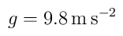

---
remote:
  user : cdclark
  host : scatcat.fhsu.edu
  root : public_html
  dest : slides/HTMLpresentations-demo

title  : HTML Presentations
subtitle : demo
---

# Math

LaTeX math is rendered using MathJax

$\nabla \cdot \vec{E} = \frac{\rho}{\epsilon_0}$

$\nabla \cdot \vec{B} = 0$

$\nabla \times \vec{E} = -\frac{\partial \vec{B}}{\partial t}$

$\nabla \times \vec{B} = \mu_0\left( \vec{J} + \epsilon_0\frac{\partial \vec{E}}{\partial t}\right)$

The mathimg macro will create an image of some LaTeX code (using tex2im) and include it instead. This doesn't look as good as MathJax, but it allows you to use arbitrary LaTeX pacackages.



# Shell

The `shell` macro will run a command and include its output.

```
> ls
eq-1.png
Makefile
slides.md
slides-processed.md

```

