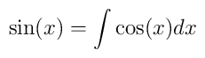

---
push:
  user : username
  host : hostname
  root : public_html
  netloc : direct
  dest : slides/HTMLpresentations-demo

title  : HTML Presentations
subtitle : demo
---

# Math

LaTeX math is rendered using MathJax

$\nabla \cdot \vec{E} = \frac{\rho}{\epsilon_0}$

$\nabla \cdot \vec{B} = 0$

$\nabla \times \vec{E} = -\frac{\partial \vec{B}}{\partial t}$

$\nabla \times \vec{B} = \mu_0\left( \vec{J} + \epsilon_0\frac{\partial \vec{E}}{\partial t}\right)$

This looks pretty good, but it is not a LaTeX compiler, so LaTeX packages are not supported.

# Math

The `\mathimg` macro will create an image of some LaTeX code (using
[tex2im](https://github.com/CD3/tex2im)) and include it instead (if `tex2im` is not
installed it will replace the macro with a standard `$...$`).

For example: . This doesn't
look as good as MathJax for inline math, but it allows you to use arbitrary LaTeX packages.

For example, this

\\mathimg{g = \\SI{9.8}{\\meter\\per\\second\\squared}}

will produce this


Since MathJax does not support the `siunitx`, this is the only way to use the \SI command.
You can also make the image larger, which is not possible with MathJax.

For example, this

\\mathimg[height="300"]{\\Delta E = \\delta Q + \\delta W}

will produce this


# Shell

The `\\shell` macro will run a command and include its output. This is useful for command line demonstration.
for example, this

\`\`\`

\> ls

\\shell{ls}

\`\`\`

will produce this

```
> ls
clean.sh
eq-1.png
eq-2.png
eq-3.png
Makefile
postprocessor
preprocessor
slides.md
slides-processed.md

```

